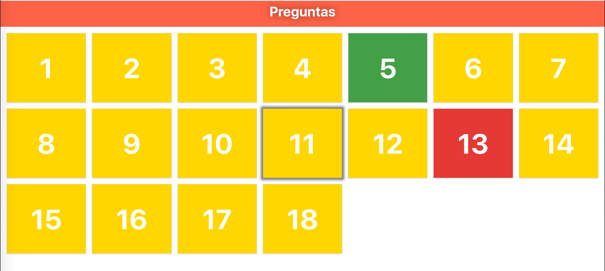

# Questions Board

## About
This app is created only to play with some logic questions in a mathematics class.

You must update `questions.json`with your own information to play correctly.

When questions are loaded you only need click over a yellow card, after click you'll se a modal with the question. When this one is answered you choose if the it was correctly answered with tht `Correcto` button.

## Local Server for data
To use the app correctly you must start these three scripts:

`npm run start:db`: To start mongodb

`npm run start:server`: To start express server

`npm run dev`: To start the client app